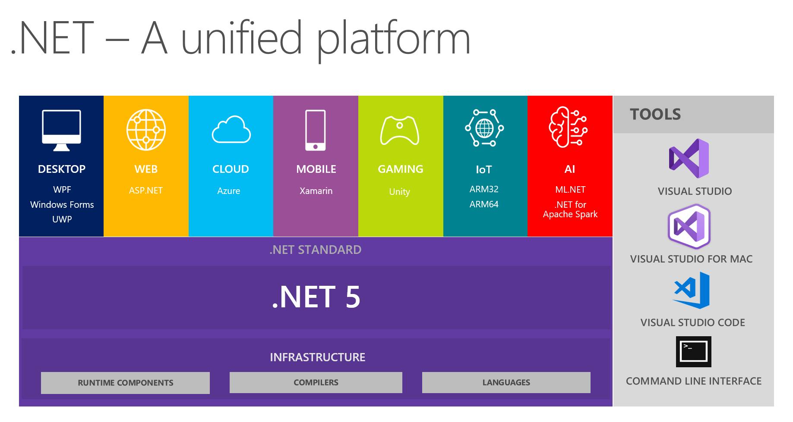

# .NET

### what is .NET?
.NET is a free, open-source, cross-platform framework developed by Microsoft for building various types of applications. 

> .NET supports the Common Language Infrastructure (CLI), so your source code is compiled into a Common Intermediate Language (CIL),independently of the programming language you use. This guarantees great interoperability between languages in the platform.

### .NET Components

The .NET architecture is based on two main components:

- **CoreCLR**: This is the .NET runtime. It is responsible for executing CLI programs and includes a just-in-time compiler.

- **CoreFX**: The platform’s API implementing the CLI Standard Libraries, that is, the set of libraries that provide the most common functionalities, such as file system management, exception handling, network communication, threading, reflection, and so on. The CoreFX component is sometimes called the Unified Base Class Library.

### .NET Application Models 
Above the core components, you have the different application model frameworks, that is, the libraries that offer support for developing different types of applications. So, for example, you have:

- **ASP.NET**: The framework that allows you to build web applications and web APIs.

- **Windows Presentation Foundation (WPF)**: A graphical user interface for Windows desktop applications.

- **Xamarin**: The framework for building cross-platform mobile, TV, and desktop applications.

- **Blazor**: The framework to build client web applications by using C#. It also allows you to generate client web apps in WebAssembly code.

- **ML.NET**: The machine learning framework that simplifies the integration of machine learning models in your .NET application.
 
.NET offers you support for most of the common programming tasks: from file management to network communication, from security to database access. For example, on the networking side, it supports socket programming, HTTP communication, and gRPC. This allows you to create microservices with the protocol that better fits your needs.
  
for more information visit blog [link](https://auth0.com/blog/what-is-dotnet-platform-overview/)
 

### .NET CLI

The .NET CLI is a command-line interface that allows you to create, build, and run .

> dotnet new gitignore

command
 

> dotnet new -h

> dotnet new --list

> dotnet new console -o DemoApp

> dotnet sln add DemoApp

>dotnet new classlib

>dotnet sln add DemoLib

> cd DemoLib

>dotnet add package Dapper

> cd ..

> cd DemoApp

> dotnet add reference ../DemoLib/DemoLib.csproj

>dotnet restore

> dotnet build

>dotnet clean

>dotnet publish -p:PublishSngleFile=true -r win-x64 --self-contained false        #for using ms build tools/properties

